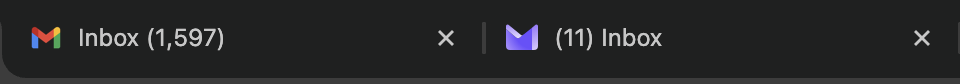

# WTWOW HUSH v1.0
**Hiding Unwanted Site Hints**

WTWOW HUSH is a Chrome Extension designed to enhance your privacy by obfuscating inactive tabs. Whether you're working in a public space like an airport or screen-sharing in a meeting, HUSH ensures that your browsing habits remain private by disguising your tabs as common, innocuous websites, and removing PII such as emails and search queries from tab titles.

## Features

### Obfuscation Modes
- **Hide All**: Obfuscates every inactive tab.
- **Exclude List**: Hides everything EXCEPT the sites you explicitly allow (default).
- **Include List**: Hides ONLY the sites you specify.

### Smart Rotation
- Automatically rotates the fake identity of inactive tabs at a set interval (e.g., every 5 minutes).
- Makes your background tabs look like you are naturally browsing different sites.

### Fake Identities
- Disguises tabs as popular sites like Google, Wikipedia, Weather, New York Times, etc.
- **Randomized Titles**: Supports dynamic titles like `({randint(1,12)}) Instagram` to mimic notification counts.
- **Custom Identities**: Add your own fake identities or remove existing ones.

### Uniform Mode
- Force all hidden tabs to look exactly the same (e.g., a generic "HUSH" tab).
- Custom title and icon support.

### Privacy First
- **Search Engine Hiding**: Automatically hides search queries on Google, Bing, etc.
- **Title Sanitization**: Removes email addresses from Gmail and Proton Mail titles to prevent accidental leaks.



### ⚡ Master Switch
- Quickly toggle the entire extension on or off with a single click.

## Installation

1. Clone this repository:
   ```bash
   git clone https://github.com/a-finance-bro/wtwow-hush.git
   ```
2. Open Chrome and navigate to `chrome://extensions/`.
3. Enable **Developer mode** in the top right corner.
4. Click **Load unpacked**.
5. Select the `wtwow-hush` directory from the cloned repo.

## Usage

1. Click the **HUSH** icon in your Chrome toolbar.
2. **Obfuscation Mode**: Choose your preferred mode. The default "Exclude List" is great for general use.
3. **Site Identities**: Customize the pool of fake sites in the "Site Identities" tab.
4. **Presets**: Save your configuration for different environments (e.g., "Work", "Public").

## Contributing

We welcome contributions! Whether it's optimizing the favicon switching speed, fixing bugs, or adding new features, feel free to open a Pull Request.

### Areas for Improvement
- **Performance**: Optimizing the speed of title/icon switching.
- **Identities**: Adding more realistic default identities.
- **Localization**: Translating the UI.

## License

AGPL 3.0 License. See [LICENSE](LICENSE) for details.
